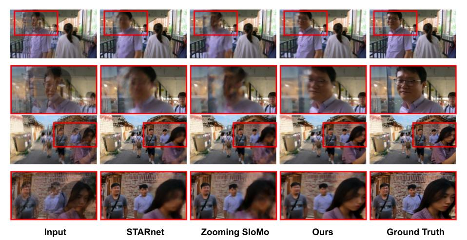

# Efficient Space-time Video Super Resolution using Low-Resolution Flow and Mask Upsampling

_Saikat Dutta, Nisarg A. Shah, Anurag Mittal_

Accepted at NTIRE workshop, collocated with CVPR 2021 [ArXiv](https://arxiv.org/abs/2104.05778) | [Paper](https://openaccess.thecvf.com/content/CVPR2021W/NTIRE/html/Dutta_Efficient_Space-Time_Video_Super_Resolution_Using_Low-Resolution_Flow_and_Mask_CVPRW_2021_paper.html) | [Poster](https://data.vision.ee.ethz.ch/cvl/ntire21/posters/NTIRE21_FMU_STSR.pdf) 




### Requirements
Create a conda environment with Pytorch-1.1, CuPy-6.0, OpenCV, SciPy.
```
conda create -n myenv
conda activate myenv
conda install pytorch==1.1.0 torchvision==0.3.0 cudatoolkit=10.0 -c pytorch
conda install -c anaconda cupy
conda install -c anaconda scipy
conda install -c conda-forge opencv
```
### Dataset
We use REDS STSR dataset for training and validation. Get the dataset by registering [here](https://competitions.codalab.org/competitions/28072#learn_the_details).
Unzip the dataset under `REDS/` directory.
```
---REDS/
  |---val/
    |---val_sharp_bicubic/
      |---X4/
    |---val_sharp/
    
```

### Training
Start your training by loading PWCNet (`checkpoints/pretrained/network-chairs-things.pytorch`) and RSDN (`checkpoints/pretrained/RSDN.pth`).

### Generate results on REDS STSR Validation dataset
```
python REDS_val.py
```

### Citation
If this project helps in your research, please cite our paper:
```
@inproceedings{dutta2021efficient,
  title={Efficient space-time video super resolution using low-resolution flow and mask upsampling},
  author={Dutta, Saikat and Shah, Nisarg A and Mittal, Anurag},
  booktitle={Proceedings of the IEEE/CVF Conference on Computer Vision and Pattern Recognition},
  pages={314--323},
  year={2021}
}
```

### Acknowledgement
The following repositories were used to develop this project :

[1] [QVI](https://sites.google.com/view/xiangyuxu/qvi_nips19)

[2] [RSDN](https://github.com/junpan19/RSDN)

[3] [PWCNet](https://github.com/sniklaus/pytorch-pwc)
